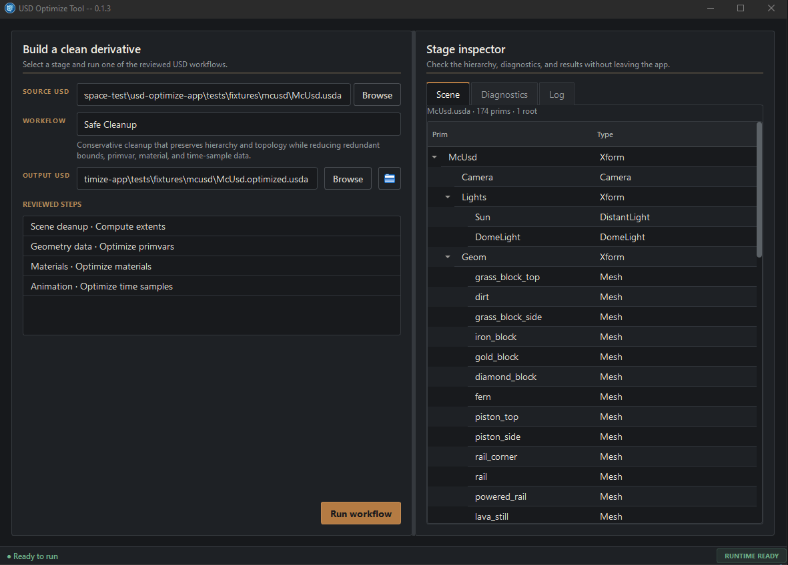

# USD Optimize App

A CLI/ GUI app for optimizing OpenUSD scenes.




## Overview

`USD Optimize App` is built around NVIDIA's `usd-optimize` runtime, with an added user-friendly CLI and GUI so you don't have to build and link it yourself. GUI workflows can target the entire stage or selected prim hierarchies.

## Packaged workflow

### 1. Download and extract

Download the latest artifact from the project releases and extract the complete directory. Do not move individual DLLs or subdirectories out of the extracted folder.

### 2. Start the GUI

Run:

```text
usdopt-gui.cmd
```

### 3. Use the CLI

Open a terminal in the extracted directory and run:

```powershell
.\usdopt.cmd doctor
.\usdopt.cmd list-presets
.\usdopt.cmd optimize --input C:\path\asset.usda --preset safe_publish
```

### 4. Verify the bundle

`manifest.json` records the bundled application, Python, PySide6, and `usd-optimize` versions. The release also includes a `.sha256` file for archive verification.

## Reviewed workflows

| Workflow | Preset | Trigger | Purpose |
| --- | --- | --- | --- |
| Safe Cleanup | `safe_publish` | Select and run | Preserve hierarchy and topology while reducing redundant bounds, primvars, materials, and exact duplicate time samples |
| Geometry Optimization | `geometry_optimization` | Select and run | Recompute extents and optimize primvar storage without changing hierarchy or topology |
| Inspect Stage | `diagnostics` | Automatic on input inspection | Populate permanent scene statistics without writing a USD derivative |
| Find Overlaps | `find_overlaps` | Select and run | Run read-only CPU overlap analysis and return structured prim paths |

Select one or more prims in the Scene tree to run a workflow on those prims and all descendants. Clear the selection to process the entire stage. Prim-scoped Safe Cleanup skips material deduplication because that NVIDIA operation can rebind consumers outside the selected hierarchy; the app marks and reports the omission.

The NVIDIA runtime registers 47 operations, but most are topology-changing, structural, hardware-dependent, or require asset-specific parameters. They remain available to developers through the operation matrix and developer presets rather than being exposed as general artist controls. Run `usdopt list-presets --all` to include those developer-only presets.

## Release validation

The Windows packaging workflow builds the portable directory from one locked app environment and one NVIDIA runtime package, then validates all of the following from inside the assembled artifact:

- runtime and operation registry discovery;
- CLI preset discovery;
- native Windows and offscreen GUI construction;
- a diagnostic operation;
- a `safe_publish` operation that writes a USD output.

The current portable ZIP is expected to be roughly 180–190 MiB. Most of the archive is the complete NVIDIA/OpenUSD runtime; Python and the trimmed Qt Widgets stack account for roughly 28 MiB compressed.

## More information

- [GUI guide](docs/gui.md)
- [Windows portable release](docs/windows-portable-release.md)
- [Operation support](docs/operation-support.md)
- [Reports](docs/report-summary.md)
- [Development guide](docs/development.md)
